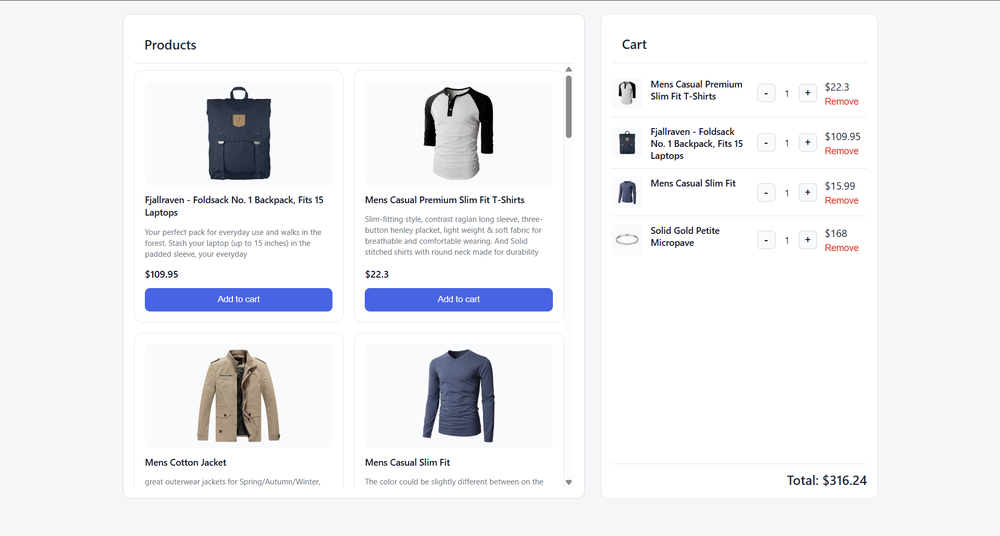
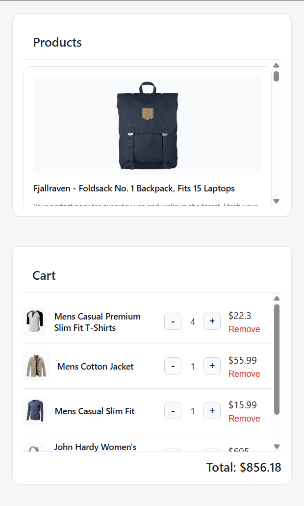
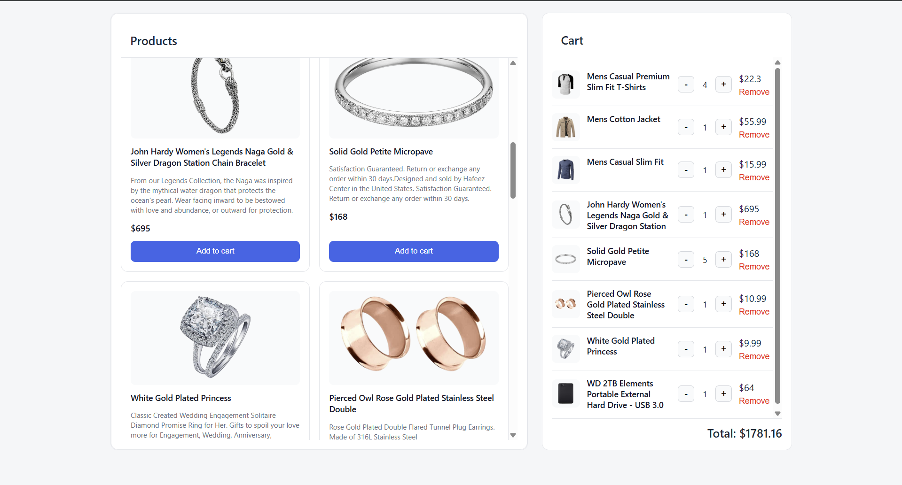
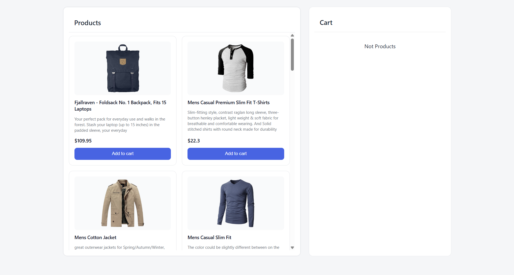

Имя: Мурод Куанышбаев
Сколько времени заняло: 7 часов
Что было сложным:  
1. Совмещение Vanilla JavaScript и React на одной странице.  
2. Подбор подходящего дизайна и цветовой палитры (структура была понятна, но чтобы интерфейс выглядел приятно, пришлось подбирать цвета).  
3. Корректная обработка длинных названий товаров, чтобы они не ломали структуру интерфейса.  
4. Синхронизация состояния корзины с localStorage.  
Скриншоты интерфейса: 
 
 
 
